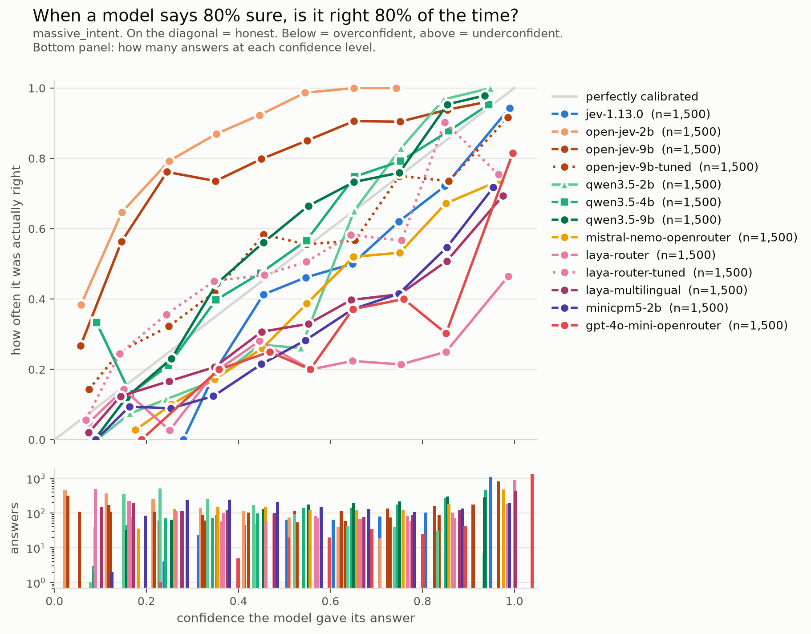

# The bench, in detail

How to install and run everything, what each probe and task measures, how to read the
charts, and the limits in full. The short version is in the [README](README.md).

## Install

```bash
python3 -m venv .venv
.venv/bin/pip install -r requirements.txt
cp .env.example .env    # then put your key in it
```

The model is pinned to `jev-1.13.0` in `probes/_common.py`, never `jev-latest`, so
measurements stay comparable across days. Everything in `results/` was measured on that
version. Override with `TYPESAFE_MODEL`.

## Running a probe

```bash
cd probes
../.venv/bin/python p2_multilingual.py --sample 100
```

Each probe writes every raw response to `results/probes/<name>-<timestamp>.jsonl` and prints its
own summary. Nothing is measured twice: the later probes replay archived runs rather than
re-calling the API, which is how `confidence_fit.py` reconstructed the confidence formula
from 800 stored responses without spending a single call.

## The probes

Each file's docstring carries the question it answers and what the answer turned out to
be. `p0` first, the rest in any order.

| | question |
|---|---|
| `p0_smoke` | what does a live response actually contain |
| `p1_determinism` | same input ×50 on a pinned version: does the answer move |
| `p2_multilingual` | does accuracy or **calibration** degrade in French |
| `p3_edges` | what happens when no option fits |
| `p4_limits` | what is the real maximum input size |
| `p5_haystack` | how far does accuracy fall as irrelevant state grows |
| `p6_distractors` | competing records in the same state |
| `p7_crossrecord` | questions that need reading every record, not finding one |
| `p8_prefill` | filling a real form from a real French bank document |
| `p9_value_selection` | picking a number the code extracted, instead of writing one |
| `p10_missing_candidate` | what happens when the regex missed the right answer |
| `p11_freetext` | a free-text situation box instead of a document upload |
| `p12_laya` | the open-weight encoder, on P2's exact benchmark |
| `p13_laya_freetext` | the same encoder on P11's French blurbs and P8's document |
| `p14_laya_temperature` | that encoder run the way its author says to run it |
| `p15_confidence_k` | does the confidence denominator follow the option count |
| `p16_independance` | does adding a question to a call move the other answers |
| `p17_small_llm` | a 2-4B local LLM held to the same output contract |
| `p18_openjev` | Open-Jev 2B and 9B on P11's blurbs and P3's edge cases |

### The loan-document probes, in plain terms

P8 to P11, P13 and P18 are not a benchmark. They are one real document and twelve handwritten
messages, so the numbers say "the task was within reach", not "this generalises". They are
here because they are the only tests in the repo on data no model could have trained on,
and because they are the shape of the actual product: prefilling a mortgage form.

- **P8, prefill from the document.** The eleven-page French offer (~13k tokens) is sent
  with 17 questions in one call, instructions in English: is the property new or
  pre-owned, is the rate fixed or variable, is the insurance on the initial or the
  outstanding capital, is there a co-borrower, a deferral, a works budget, a state
  subsidised loan, and so on. Seven Choice, nine Noul, one Score. Repeated 20 times.
  Result: 340 answers, 340 right. Under the form's own policy (prefill silently above 0.9,
  prefill with a flag between 0.6 and 0.9, leave empty below), 290 prefilled silently, 50
  flagged, none silently wrong.
- **P9, pick the number rather than write it.** Code regexes 22 distinct amounts and rates
  out of the document. For each of 20 fields (loan amount, monthly instalment with and
  without insurance, notary fees, APR, ...), the model is asked which candidate is the
  right one, with "none" as an option. Several candidates differ by one digit on purpose.
  Five repetitions: 100 of 100, and the one field absent from the document got "none".
- **P10, the candidate list is wrong.** Same as P9, but the correct amount is removed from
  the list while it stays in the document. The dangerous outcome would be a confident pick
  of the nearest wrong number. Observed: 24 of 24 answers were "none", at confidences
  between 0.53 and 0.97. Regex coverage is a quality problem, not a silent-corruption bug.
- **P11, a free-text box instead of a document.** Twelve handwritten French blurbs, kept
  deliberately messy: abbreviations, typos, no punctuation, missing or contradictory
  information. Questions: project type, new or pre-owned, household, whether a subsidised
  loan is mentioned, and which bare number is the price, the income and the deposit. Most
  fields are absent from most blurbs, so the right answer is usually "not stated". Three
  repetitions: 252 of 252 graded answers right. A usefulness score is recorded for
  stability but has no gold and is not graded.
- **P13, Laya on the same inputs.** 123 of 288 on the blurbs. The document does not fit
  its 512 to 1024 token window, and the probe measures how much of it survives truncation
  rather than pretending to run it.
- **P18, Open-Jev on the blurbs.** One run each, since nothing is sampled. 2B: 64 of 84,
  25 of 39 on fields not stated, mostly a household invented at low confidence; one
  confident error, a PTZ question answered no at 0.98. 9B: 80 of 84, 39 of 39 on fields
  not stated, and all four misses are "not stated" answers below 0.6. On P3's no-match
  case both spread the probability (top option 0.52 and 0.43) where Jev picked one at 0.74.

Two scripts are not probes. `calibration.py` draws the reliability diagram over every
graded Jev answer archived, which checks the vendor's calibration claim and ranks nothing.
`confidence_fit.py` fits the confidence formula from archived responses.

## The bench

Model comparisons live in `bench/`: tasks in `bench/tasks/`, one adapter per model family
in `bench/models/`, and `REGISTRY` in `bench/models/__init__.py` naming every model.
Adding a model is one registry line, plus an adapter file if the family is new. Each run
writes `results/bench/<model>/<task>.jsonl` and a `<task>.json` manifest (versions, git
sha, device, HF revision); the directories present now were migrated from the probe
archives and say so in their manifest. Hosted models (Jev, OpenRouter) take `--workers N`
to run N calls in parallel, rows kept in order; local models refuse anything above 1.

```bash
# run one model on one task (overwrites that model's previous run)
.venv/bin/python bench/run.py --model qwen3.5-4b --task massive_scenario --sample 100

# regenerate results/bench/summary.md and figures/{risk-coverage,reliability}-<task>.png
.venv/bin/python bench/report.py

# replay every model on every task, then regenerate
for m in jev-1.13.0 laya-router laya-multilingual qwen3.5-4b minicpm5-2b \
         qwen3.5-0.8b-mlx-4bit mistral-nemo-openrouter gpt-4o-mini-openrouter; do
  for t in massive_scenario massive_intent; do
    .venv/bin/python bench/run.py --model "$m" --task "$t" --sample 500
  done
done && for t in massive_scenario massive_intent; do
  .venv/bin/python bench/run.py --model laya-router --task "$t" --split dev --sample 200 --seed 7
  .venv/bin/python bench/derive_tuned.py --model laya-router --task "$t"
done && .venv/bin/python bench/report.py
```

Two tasks, same MASSIVE items:

- `massive_scenario`: 18 scenarios, conditions EN_V1 / EN_EN / FR_EN / FR_FR.
- `massive_intent`: 60 intents, conditions EN_EN / FR_EN / FR_FR, criteria written from
  the `dev` split only. Published reference: `xlm-r-base-amazon-massive-intent`, fine-tuned,
  87.75% accuracy on en-US.

`--split dev` writes `<task>.dev.jsonl` next to the test run instead of overwriting it; the
report ignores it. `<model>-tuned` rows are not runs: `bench/derive_tuned.py --model <model>
--task <task>` fits a temperature on the stored dev run (one per Laya checkpoint) and applies
it to the stored test run, with no model call. `laya-router-tuned` and `open-jev-9b-tuned`
are fitted on dev 200 pairs, seed 7, EN_EN and FR_FR. Laya rounds its probabilities to four
decimals, so a confident answer stores its losers as exactly 0 and the rescale has nothing
to work with. `bench/models/laya.py` therefore also stores `log_probabilities` from Laya's
raw logits, and `derive_tuned.py` refuses rows that only carry rounded zeros.
OpenRouter models (`bench/models/openai_compat.py`) need `OPENROUTER_API_KEY` in `.env`;
`PRICES` in `bench/models/__init__.py` feeds the report's `$/1k items` column.

`qwen3.5-0.8b-mlx-4bit` (`bench/models/mlx_logits.py`) holds a local LLM to the same
prompt and label-token contract, but runs a 4-bit MLX checkpoint on Apple's MLX runtime:
the laptop-feasibility number. It appears in the summary table but not in the charts
(`TABLE_ONLY` in `bench/report.py`): it answers whether a solo developer can try the idea
on a laptop, not how it ranks against 9B models. The bf16 PyTorch rows run on Modal.

**Running on a rented GPU.** Every open-weight model that runs through `transformers`
(Open-Jev, `bench/models/openjev.py`, which needs Linux and CUDA, and the `hf_logits` rows)
runs on Modal: `bench/modal_run.py` runs `bench/run.py` on a Modal GPU and copies the
results back. All published open-weight rows ran on an A100-80GB in bf16, so their latency
columns compare (why: `docs/decisions/0001-open-weight-runs-on-one-gpu.md`). The first run
builds the image and downloads the weights into a Modal volume; later runs reuse both.

```bash
.venv/bin/modal setup   # once: log in
.venv/bin/modal run bench/modal_run.py --model open-jev-2b --task massive_scenario --sample 500
# the dev run behind open-jev-9b-tuned, then derive_tuned.py as above
.venv/bin/modal run bench/modal_run.py --model open-jev-9b --task massive_intent \
  --gpu A100-80GB --split dev --sample 200 --seed 7
.venv/bin/modal run bench/modal_run.py --model qwen3.5-9b --task massive_intent \
  --sample 500 --gpu A100-80GB
```

A full pass costs about $0.10 to $0.35 on an A100-80GB. Launch at most three at a time:
more hits Modal's app-creation rate limit.

Results land in `results/bench/<model>/` like any local run, and the manifest names the
GPU (`"gpu"`). `--probe p18_openjev.py --model open-jev-2b` runs a probe instead, and its
`results/probes/` files come back.

### Tuned rows

Not zero-shot: what 200 labeled examples buy, on 60 intents.

- Open-Jev 9B is too unsure of itself. Tuned, 55% of traffic passes the 0.90 threshold instead of
  12%, and 92% of it is right. Still below Jev's 73%, because its accuracy is lower.
- Laya router is far too sure of itself (ECE 0.44). Tuned, its probabilities become much
  more honest (ECE 0.08), and 12% of traffic passes the 0.90 threshold, but only 76% of that is
  right: it is right 36% of the time overall.

### P17 and the small LLMs

`p17_small_llm.py` takes any Hugging Face causal LM and holds it to the same output
contract as Jev without generating anything: the prompt ends on an answer prefix, one
forward pass gives the next-token logits, and the softmax is taken over the option-label
tokens alone.

```bash
../.venv/bin/python p17_small_llm.py --model openbmb/MiniCPM5-2B --sample 100
../.venv/bin/python p17_small_llm.py --model Qwen/Qwen3.5-4B   --sample 100
```

Weights download on first run, around 5 GB and 8 GB. `--device` defaults to `mps`; use
`cpu` or `cuda` elsewhere. There is no seed argument, and that is the point: nothing is
sampled, so the run is deterministic by construction.

## Reading the charts

No machine-learning background needed. For every question, a model picks one answer and
attaches a number between 0 and 1: how sure it is. Two things can be true or false about
that pair. Is the answer right? And does the number mean what it says? The two charts
answer those two questions separately.

**Risk-coverage: what happens if you trust the number.**


Imagine the rule "if the model is sure enough, take its answer automatically, otherwise
send it to a human". Slide the threshold for "sure enough" from strict to loose. A strict threshold lets
few answers through, but they are good. A loose threshold lets most through, some wrong. The
curve draws that trade-off: left is strict, right is loose, higher is better everywhere.
This is the chart that ranks models.

The dots are the three thresholds that appear in TypeSafe's docs examples: 0.60 (enough for a
low-stakes action), 0.85 (enough to act automatically on a high-stakes one) and 0.90 (the
strictest). A dot
says: with that exact threshold, this share of traffic passes (x) and this is how often it is
right (y). On the 60-intent task at the 0.90 threshold, Jev passes 73% of traffic and is right on
94% of it; GPT-4o mini passes 90% and is right on 82%. GPT-4o mini says "I'm 90% sure" far
too often, so trusting its number automates more and gets more wrong. That is the
difference between accuracy and a usable confidence, and it is what the bench looks for.

Jev's curve starts in the middle because Jev says exactly 1.00 for about half of its
answers. Even the strictest threshold lets all of those through at once, so nothing can be
plotted to the left. Nothing is missing; Jev cannot be split finer than that at the top.

**Reliability: does the number mean what it says.**



Group the answers by the number the model gave, and for each group count how many were
right. If the answers marked "about 0.7" were right 70% of the time, the model is honest,
and its dot sits on the grey diagonal. Below the diagonal means it is more sure than it
should be. The bars underneath show how many answers fell in each group.

The trap: honest is not the same as good. Tuned Laya's dots sit close to the line, yet it
is right 36% of the time: most of its answers say "I am not sure", and they are right not
to be. It is still wrong two times in three, which is why this chart ranks nothing. Jev's dots dip
a little under the line in the middle (when it says 0.8 it is right about 72% of the time),
but most of its answers are in the last group at 1.0, and 94% of those are right.

One legend detail: a model can show fewer answers here than in the table (Mistral Nemo,
1,481 of 1,500). Those calls came back from a provider that ignored the request for
probabilities. They count for accuracy, not for calibration.

## What the bench does not show

Read `summary.md` with these in mind. None of them is hidden in the numbers, but none of
them is visible in a table cell either.

- **One dataset, one input shape, one primitive.** Every cross-model number is a Choice
  over MASSIVE assistant commands of five to ten words. Long documents, competing records,
  abstention, Noul and Score were only measured on Jev (P5 to P11), plus Laya on P11 and
  P8 (P13) and Open-Jev on P11 (P18). Whether a small LLM holds up on an eleven-page document is not measured here.
- **Answer labels past 26 options.** LLM rows answer with one label token per option:
  `A-Z`, then `a-z`, then `0-7`, 60 distinct tokens. Small models read `a` as `A`. On
  `massive_intent`, accuracy by the gold label's position:

  | model | `A-Z` | `a-z` | `0-7` |
  |---|---|---|---|
  | qwen3.5-2b | 39% | 4% | 4% |
  | minicpm5-2b | 38% | 28% | 11% |
  | qwen3.5-4b | 74% | 74% | 76% |
  | qwen3.5-9b | 79% | 72% | 72% |

  When the gold label is lowercase, Qwen3.5 2B picks its uppercase twin 27% of the time.
  So the 2B and 0.8B rows understate those models on 60 intents, and Open-Jev 2B's lead
  over its base there (66% against 20%) is inflated; at the `A-Z` rate the base would sit
  near 39%. The 18-scenario task stops at `R` and is unaffected, as are Jev, Laya and
  Open-Jev, which do not use labels. A label scheme that holds past 26 options for every
  LLM adapter, OpenRouter included, is not done yet.
- **Rows have different sample sizes.** Every model ran 500 items per condition except the
  `-tuned` rows, which are derived. Read each row's `n` and interval before comparing two
  rows.
- **Latency columns measure different things.** Jev is a hosted API called from France;
  its median moved from 237 ms to 480 ms between two sessions on the same code. Open-weight
  rows time one forward pass in bf16 on a Modal A100-80GB, and Modal does not pin the
  variant: the manifest's `gpu` field says whether a run got the SXM4 or the PCIe card.
  Qwen3.5's linear-attention layers run without the `causal_conv1d` kernel, so absolute
  latency is pessimistic for Qwen and Open-Jev alike. Open-Jev reads the input once per
  option with prefix caching off, as upstream ships it, which is why it costs about four
  times the tokens of its Qwen base. The 0.8B MLX row times an M3. None of these is what a
  served deployment would show.
- **Contamination.** MASSIVE has been public since 2022 and is very likely in the
  pretraining data of the open LLMs. Whether Jev saw it is unknown. Four things in the
  archives argue against memorisation without proving it: rewording the criteria moved
  Jev by five points, which a memorised label set would not care about; on the rows where
  MASSIVE's own labels are arguable, Jev sided against the dataset; on the 60 intents it
  scores below an encoder fine-tuned on this very dataset (84% against 87.75%); and on the
  private documents nobody could have trained on (P8, P11) it scored 100%. The honest fix
  is more cross-model tasks on private data, which is not done yet.
- **Gold labels are arguable on a few percent of rows**, so ECE is an upper bound. This
  applies to every model equally.
- **The criteria were written by one person.** For the 18 scenarios, V2 was written after
  reading V1's errors on the test rows, which is why V1 stays in the table. For the 60
  intents the criteria were written from the `dev` split only. Any Jev-versus-X gap is
  partly a gap between how well the criteria suit each model.
- **One question per call.** Jev's multi-question fan-out, which P16 measured on its own,
  is never compared against the other models.
- **Laya ran zero-shot**, which is not the mode its authors recommend; they position it as
  a base to fine-tune.
- **Hosted LLM rows are OpenRouter's, not a vendor's.** `mistral-nemo-openrouter` and
  `gpt-4o-mini-openrouter` go through OpenRouter, which picks the provider per call among
  those that honour `logprobs` (the manifest lists which ones served the run), so two runs
  can hit different hardware and quantisations. Their probabilities are the softmax over
  the option letters found among the first token's top 20 logprobs, not the full
  vocabulary. Their latency includes the network from France, like Jev's.

## Data

**P2, P12, P17** use [MASSIVE](https://github.com/alexa/massive): parallel
virtual-assistant utterances, professionally translated, CC BY 4.0 (the code around it is Apache 2.0), no personal data.
`en-US` and `fr-FR` rows sharing an `id` are the same utterance, which is what makes the
FR/EN comparison clean.

Fetch it from Amazon directly. The HuggingFace mirror ships a loader script, which
`datasets` 4+ refuses to execute.

```bash
mkdir -p data && curl -sL -o data/massive-1.1.tar.gz \
  https://amazon-massive-nlu-dataset.s3.amazonaws.com/amazon-massive-dataset-1.1.tar.gz
tar xzf data/massive-1.1.tar.gz -C data 1.1/data/en-US.jsonl 1.1/data/fr-FR.jsonl
```

**P8, P9, P10, P13** use `data/proposition-redacted.txt`, which ships with the repo: a real
eleven-page French mortgage offer with every direct identifier replaced by a bracketed
placeholder. The figures, rates, durations and insurance terms are intact, because they are
what is under test. `redact_proposal.py` produced it and verifies its own work, but its
substitution table is a list of one person's identifiers, so that file is gitignored and the
script only runs on the machine holding the source PDF.

**P5** buries its needle in French filler that is not in the repo. Point `FR_CORPUS` at a
directory of French `.md` prose of comparable register, or drop files in `data/fr-corpus/`.
Its English counterpart is built once by `fetch_en_corpus.py` from Wikipedia.

**No client data in this repo**, anonymised or otherwise. The one real document is the
author's own.
