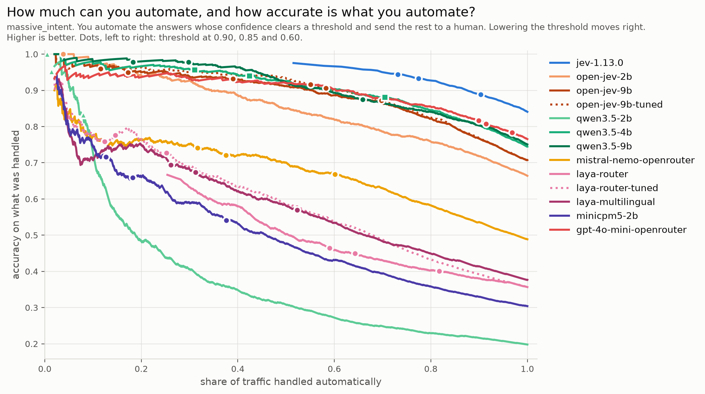

# typed-decision-bench

A small benchmark on one question: does Jev, TypeSafe's typed decision model, hold up in
French? And how does it compare, in English and in French, to the alternatives you could
use instead?

**TL;DR.** On 60 intents, Jev loses one point from English to French (85% to 84%), where
the other models lose four to eight. Its probabilities stay honest in both languages (ECE
0.07 in English, 0.06 in French): 73% of traffic passes a 0.90 confidence threshold, and 94% of
what passes is right. The closest alternatives are GPT-4o mini (second on accuracy, but
its "0.90" is right 82% of the time) and a self-hosted Qwen3.5 4B or 9B.

A typed decision model takes a state (free text, a JSON object, a document) and a list of
typed questions with their criteria. It returns a probability for each option of each
question, and generates no text. TypeSafe makes no claim about multilingual capabilities
either way.

**Caveats.** This is a first check, not a verdict: one dataset, one kind of question, and
it says *whether* Jev holds up in French, not *how far* or *why* (see [Limits](#limits)).
Every model is used zero-shot, the way a small team would build a proof of concept: you
write the options and their criteria, with no labeled data or fine-tuning. How hard each
model is to run is stated but not scored. It is a snapshot of `jev-1.13.0` in September
2026, with no updates planned. Every number comes from a script in this repo and is stored
as raw JSON under `results/`, so it can be checked without calling any API again.

## Setup

**Models compared.**

- **Jev 1.13.0** (TypeSafe), hosted API. Pinned version, never `jev-latest`.
- **GPT-4o mini** and **Mistral Nemo**, hosted, through OpenRouter.
- **Open-Jev 2B and 9B**, open models trained for the same contract as Jev, run on a
  rented GPU.
- **Laya**, an open encoder (300-400M) that copies Jev's interface, run on a laptop. It
  ships as two checkpoints, *multilingual* (a base meant to be fine-tuned) and *router*;
  the table shows the multilingual one, which scores higher.
- **Qwen3.5 2B, 4B and 9B, MiniCPM5 2B**, open LLMs, run on the same rented GPU as
  Open-Jev. Qwen3.5 2B and 9B are the frozen bases Open-Jev is built on, so they show what
  its fine-tune adds.
- **Qwen3.5 0.8B (4-bit)**, run on a laptop to check whether a solo developer can try the
  idea locally. It is in the table, not in the charts.

Every model gets the same contract: one answer per question, plus a probability for each
option. LLMs are not allowed to write text; their probability is read from the next-token
scores of the option labels.

**Data.** [MASSIVE](https://github.com/alexa/massive), short voice-assistant commands
("wake me up at seven"), professionally translated. The English and French versions of a
command share an id, so the same item can be tested in both languages.

**Conditions.** `EN_EN` is an English command with English criteria. `FR_EN` is a French
command with English criteria, the common case in a company. `FR_FR` is French on both
sides.

**The threshold.** In practice you trust the model's answer only if its probability is above a
threshold, and send the rest to a human. This bench uses 0.90, the strictest threshold in TypeSafe's
docs examples (they consider 0.85 enough to act automatically on a high-stakes action). So
two numbers matter besides accuracy: how much traffic passes the 0.90 threshold (*coverage*),
and how often the answers that pass are right.

## Tests

1. **18 scenarios** (`massive_scenario`): which area of the assistant is the command about?
2. **60 intents** (`massive_intent`): what exactly does the command ask for? Same commands,
   500 per condition.
3. **Probes, mostly Jev only**: determinism, what happens when no option fits, input size
   limits, long and noisy inputs, and a real eleven-page French mortgage offer plus twelve
   messy French messages. Laya and Open-Jev ran on the French messages too, and Open-Jev on
   the no-option-fits case. Listed and explained in [BENCH.md](BENCH.md#the-probes).

The same command gets both labels. Intents split each scenario into finer actions:

| command | scenario (1 of 18) | intent (1 of 60) |
|---|---|---|
| wake me up at five am this week | alarm | alarm_set |
| cancel my seven am alarm | alarm | alarm_remove |
| what alarms i have set | alarm | alarm_query |

Picking the scenario is telling an alarm command from a music one. Picking the intent is
telling apart three alarm commands that share most of their words, among 60 options.

## Results

**60 intents**, 500 commands per condition. Accuracy and ECE are split by condition to
show the French gap. ECE measures how far the probabilities are from reality (0 is
perfect). Coverage and precision at 0.90 are over all three conditions.

| model | acc EN_EN | acc FR_EN | acc FR_FR | ECE EN_EN | ECE FR_FR | passes 0.90 | right above 0.90 | $ / 1k items |
|---|---|---|---|---|---|---|---|---|
| Jev 1.13.0 | 85% | 83% | 84% | 0.07 | 0.06 | 73% | 94% | 0.08 |
| GPT-4o mini | 81% | 74% | 75% | 0.17 | 0.20 | 90% | 82% | 0.14 |
| Qwen3.5 9B | 80% | 71% | 74% | 0.09 | 0.06 | 18% | 98% | self-hosted (GPU) |
| Qwen3.5 4B | 80% | 70% | 74% | 0.02 | 0.09 | 31% | 96% | self-hosted (GPU) |
| Open-Jev 9B | 74% | 71% | 68% | 0.29 | 0.21 | 12% | 96% | self-hosted (GPU) |
| Open-Jev 2B | 69% | 65% | 64% | 0.47 | 0.42 | 0% | - | self-hosted (GPU) |
| Mistral Nemo | 53% | 45% | 49% | 0.20 | 0.17 | 32% | 74% | 0.02 |
| Laya multilingual | 42% | 36% | 35% | 0.17 | 0.21 | 26% | 69% | self-hosted (laptop) |
| MiniCPM5 2B \* | 35% | 29% | 27% | 0.25 | 0.22 | 13% | 72% | self-hosted (GPU) |
| Qwen3.5 2B \* | 24% | 15% | 20% | 0.16 | 0.09 | 1% | 100% | self-hosted (GPU) |
| Qwen3.5 0.8B (4-bit) \* | 12% | 8% | 8% | 0.15 | 0.15 | 0% | - | self-hosted (laptop) |

\* Understated by the answer format. With 60 options, the LLMs answer with a label from
`A-Z`, then `a-z`, then `0-7`. Small models confuse `a` with `A`: Qwen3.5 2B is right 39%
of the time when the answer sits in `A-Z` and 4% beyond it. The 4B and 9B are not affected.
Details in [BENCH.md](BENCH.md#what-the-bench-does-not-show).

Other charts: [risk-coverage, 18 scenarios](figures/risk-coverage-massive_scenario.png),
[calibration, 60 intents](figures/reliability-massive_intent.png),
[calibration, 18 scenarios](figures/reliability-massive_scenario.png).

Each curve shows what happens as you move the confidence threshold from strict (left) to loose
(right). Higher is better everywhere. The dots mark a confidence threshold of 0.90, 0.85 and 0.60, left to right. How to
read it in detail: [BENCH.md](BENCH.md#reading-the-charts).

The chart also shows `-tuned` rows: a single temperature fitted on about 200 labeled
examples, which changes how sure a model says it is but not its answers. That is outside
the zero-shot scope; see [BENCH.md](BENCH.md#tuned-rows).

**18 scenarios.** Every model scores higher here: fewer options, and the options are far
apart. The 60 intents are where models separate. Jev scores 91% in English and 89% in French. Qwen3.5 9B scores 86% and
83%, Qwen3.5 4B 86% and 79%, Open-Jev 9B 81% and 78%. Mistral Nemo reaches 78% here but
falls to 49% with 60 options.

**The French mortgage document.** Jev answered 17 questions on an eleven-page French loan
offer, 20 times: 340 answers, 340 right. On twelve messy French messages: 252 of 252.
Open-Jev 9B got 80 of 84 on the messages, and its misses are all a cautious "not stated";
Open-Jev 2B got 64 of 84, mostly by inventing facts. This is one document and twelve
messages, so it shows the task is within reach, not that the result generalises. It is
also the only data in the repo that no model could have seen during training. Details in
[BENCH.md](BENCH.md#the-loan-document-probes-in-plain-terms).

All numbers, with confidence intervals, Brier score, latency and the other conditions:
[`results/bench/summary.md`](results/bench/summary.md).

## Conclusion

Jev holds up in French on this benchmark. On 60 intents it loses one point from English to
French, where the other models lose four to eight. Its probabilities stay just as reliable
in French.

Its advantage is neither price nor raw accuracy. It is probabilities you can set a threshold
on, for many questions in one hosted call of a few hundred milliseconds, with nothing to
host.

- GPT-4o mini comes closest on accuracy, but its "0.90" is right 82% of the time. A 0.90
  threshold on it lets through more traffic and more mistakes.
- Open-Jev, trained for the same contract, keeps its accuracy as the number of options
  grows, where a general LLM like Mistral Nemo collapses. But at 9B it scores below the
  Qwen3.5 9B it is built on, on both tasks, with worse calibrated probabilities, and it
  costs about four times the compute because it reads the input once per option. At 2B
  it beats its base on accuracy, partly because of the answer-format issue above.
- A 4B or 9B open LLM gets most of the quality under the same contract, with honest
  probabilities, but you have to host it, and it runs once per question.
- Anything smaller does not work, and Laya needs to be trained on your data first.

## Limits

- **One dataset, one kind of question.** All cross-model numbers are single-choice
  questions on short MASSIVE commands. Long documents and abstention were only tested on
  Jev (and partly Laya).
- **Possible contamination.** MASSIVE has been public since 2022, and the open LLMs have
  very likely seen it. Nobody knows whether Jev has. Some signs point against memorisation
  (details in [BENCH.md](BENCH.md#what-the-bench-does-not-show)), but none prove it.
- **One author.** The criteria were written by one person, and may suit some models better
  than others.
- **Answer labels past 26 options.** The 2B and 0.8B rows understate those models on 60
  intents (see the note under the results table).
- **One question per call.** Jev can answer many questions in one call. That was measured
  on its own, never compared against the other models.

The full list: [BENCH.md](BENCH.md#what-the-bench-does-not-show).

## Licence

The code is under the [MIT licence](LICENSE).

The MASSIVE commands stored under `results/` (`state` in `results/bench/`, `utterance`
in the P2, P12, P14 and P17 probe archives) are a sample of
[MASSIVE 1.1](https://github.com/alexa/massive), © Amazon.com Inc. or its affiliates,
licensed under [CC BY 4.0](https://creativecommons.org/licenses/by/4.0/). They are
sampled from the test and dev splits and otherwise unchanged; the MIT licence does not
apply to them.

## More

- [BENCH.md](BENCH.md): install, run the probes and the bench, add a model, read the
  charts, the data sources.
- [TypeSafe](https://typesafe.ai), [docs](https://docs.typesafe.ai) and their own
  [workflow evals](https://evals.typesafe.ai/): Jev, and the vendor's comparison of typed
  workflows against single prompts on the same models. Their evals rank workflows; this
  repo ranks models on one contract.
- [Laya](https://github.com/NandhaKishorM/laya) by Convai Innovations, weights on
  [Hugging Face](https://huggingface.co/convaiinnovations/laya).
- [Open-Jev](https://github.com/Zefan-Cai/Open-Jev) by Zefan Cai,
  [project page](https://zefan-cai.github.io/open-jev/): LoRA adapters and decision heads
  on frozen Qwen3.5 weights, trained for the same three primitives. Its own benchmarks
  report accuracy on its own generated data and no calibration.
- [SemIf, formerly OpenJev](https://openjev.com/): an independent in-browser demo of the
  same constrained-logits trick, unrelated to Open-Jev above.
- [MASSIVE](https://github.com/alexa/massive), the dataset every cross-model number is on.
