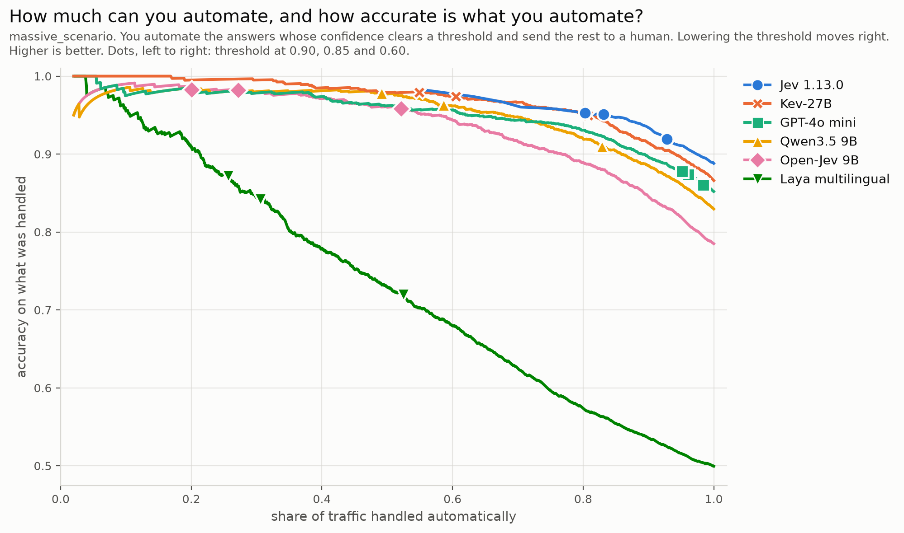
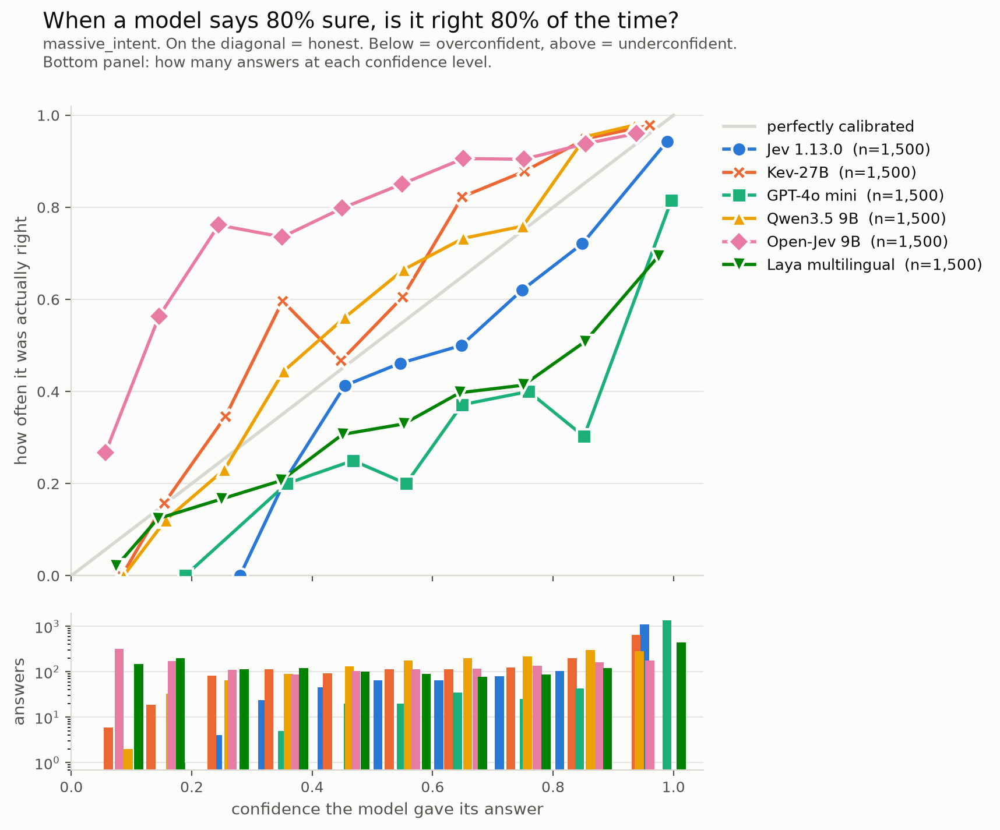

# MASSIVE: voice-assistant commands, English and French

The 60-intent results are in the [README](../README.md#1-voice-assistant-commands-english-and-french).
Here: how the two tasks are built, the 18 scenarios, the rows the README leaves out, the
calibration chart, and why the result is probably not memorisation.

## How the tasks are built

- **Items.** [MASSIVE 1.1](https://github.com/alexa/massive), `en-US` and `fr-FR`. Rows that
  share an id are the same command, professionally translated, which is what makes the
  English-to-French comparison clean. 500 test items (seed 42), the same for every condition
  and every model.
- **`massive_intent`**, 60 options. The criteria were written from the `dev` split only: about
  eight dev commands per intent, read beside the intent name. `audio_volume_other` has no dev
  row; its criterion was written from `train`. No test row was read.
- **`massive_scenario`**, 18 options, four conditions. `EN_V1` is the first draft of the
  English criteria. The final set (`EN_EN`) was written after reading V1's errors on test
  rows, so it fits those rows a little; V1 stays in the table to show what rewording is worth.
- **Instructions**: "Which intent does this virtual assistant request express" and "Quelle
  intention exprime cette requête adressée à un assistant vocal"; for scenarios, "Which
  scenario does this virtual assistant request belong to" and "À quel scénario appartient
  cette requête adressée à un assistant vocal".

## 18 scenarios

| model | `EN_V1` | `EN_EN` | `FR_EN` | `FR_FR` | at 0.90: passes / right | automatable |
|---|---|---|---|---|---|---|
| Jev 1.13.0 | 86% | 91% | 90% | 89% | 80% / 95% | 83% |
| Kev-27B | 83% | 89% | 87% | 87% | 55% / 98% | 80% |
| GPT-4o mini | 83% | 88% | 85% | 85% | 95% / 88% | 62% |
| Qwen3.5 9B | 79% | 86% | 84% | 83% | 49% / 98% | 68% |
| Open-Jev 9B | 77% | 81% | 78% | 78% | 20% / 98% | 58% |
| Laya multilingual | 54% | 54% | 46% | 45% | 26% / 87% | 12% |
| Kev-9B | 73% | 84% | 81% | 81% | 28% / 99% | 57% |
| Qwen3.5 4B | 77% | 86% | 79% | 79% | 49% / 97% | 62% |
| Mistral Nemo | 76% | 83% | 77% | 78% | 70% / 90% | 8% |
| Open-Jev 2B | 66% | 74% | 72% | 60% | 0% / - | 26% |
| MiniCPM5 2B | 65% | 55% | 37% | 41% | 21% / 95% | 20% |
| Qwen3.5 2B | 62% | 72% | 57% | 56% | 10% / 95% | 22% |
| Qwen3.5 0.8B (4-bit) | 35% | 39% | 28% | 29% | <1% / 100% | 6% |
| Laya router | 66% | 60% | 45% | 34% | 65% / 63% | 0% |

The charts draw the README's six models; the other rows are in the tables only. Every model
scores higher than on 60 intents: fewer options, and far apart. Mistral Nemo
reaches 78% here and falls to 49% on 60 intents, so the 60 intents are where models separate.

Laya multilingual ran at the English checkpoint's lengths (512 tokens, 192 for the question
and options), not its own (1,024 and 256). On the 18 scenarios each option was cut to about
9 tokens instead of 13; on 60 intents both settings cut every option to Laya's floor of 4. It
is one setting a team would tune for its own options, so it was not rerun.
Rewording the criteria (V1 to `EN_EN`) moved Jev five points, more than switching the
command to French.



## The rows the README leaves out, on 60 intents

| model | `EN_EN` | `FR_EN` | `FR_FR` | at 0.90: passes / right | automatable |
|---|---|---|---|---|---|
| Kev-9B | 76% | 73% | 74% | 15% / 99% | 40% |
| Qwen3.5 4B | 80% | 70% | 74% | 31% / 96% | 38% |
| Mistral Nemo | 53% | 45% | 49% | 32% / 74% | 1% |
| Open-Jev 2B | 69% | 65% | 64% | 0% / - | 19% |
| MiniCPM5 2B | 35% | 29% | 27% | 13% / 72% | 2% |
| Qwen3.5 2B | 24% | 15% | 20% | <1% / 100% | 4% |
| Qwen3.5 0.8B (4-bit) | 12% | 8% | 8% | 0% / - | <1% |
| Laya router | 45% | 31% | 31% | 59% / 46% | 0% |
| XLM-R fine-tuned | 89% | 81% | 81% | 64% / 93% | 54% |
| Open-Jev 9B, tuned | 74% | 71% | 68% | 55% / 92% | 33% |
| Laya router, tuned | 45% | 31% | 31% | 12% / 76% | <1% |

**The small LLMs are understated by the answer format.** With 60 options, an LLM answers
with one label token per option: `A-Z`, then `a-z`, then `0-7`. Small models read `a` as
`A`. Accuracy by where the right answer's label sits:

| model | `A-Z` | `a-z` | `0-7` |
|---|---|---|---|
| Qwen3.5 2B | 39% | 4% | 4% |
| MiniCPM5 2B | 38% | 28% | 11% |
| Qwen3.5 4B | 74% | 74% | 76% |
| Qwen3.5 9B | 79% | 72% | 72% |

When the right label is lowercase, Qwen3.5 2B picks its uppercase twin 27% of the time. So
Open-Jev 2B's lead over its base (66% against 20%) is inflated: at the `A-Z` rate, the base
would sit near 39%. The 18 scenarios stop at `R` and are unaffected, as are Jev, Kev, Laya
and Open-Jev, which use no labels. A label scheme that holds past 26 options for every LLM
adapter, OpenRouter included, is not done.

**XLM-R, fine-tuned on MASSIVE's English training split**, is the labelled-data reference. It
beats Jev in English (89.4% against 85.4% on the same items, McNemar p = 0.01) and loses in
French, since it ignores the criteria: its `FR_EN` and `FR_FR` are identical by construction.

**The `-tuned` rows** show what 200 labelled examples buy. A single temperature is fitted on
dev and applied to the stored test run; it changes how sure a model says it is, never its
answers.

- Open-Jev 9B is too unsure of itself. Tuned, 55% of traffic passes 0.90 instead of 12%, and
  92% of it is right. Still below Jev, because its accuracy is lower.
- Laya router is far too sure of itself (ECE 0.44). Tuned, its probabilities become honest
  (ECE 0.08), but it is still right on 36% of commands, and nothing can be automated.
- Laya rounds its probabilities to four decimals, so a confident answer stores its losers
  as exactly 0 and a temperature has nothing to rescale. Its adapter stores log-probabilities
  from the raw logits, and `bench/derive_tuned.py` refuses rows that only carry rounded zeros.

## Does the number mean what it says?

The risk-coverage chart in the README ranks models. This one checks honesty, and ranks
nothing.



Answers are grouped by the probability the model gave its answer, and each group's dot shows
how often it was right. On the grey diagonal, the model is honest; below it, more sure than
it should be. The bars underneath count the answers in each group.

Honest is not the same as good. Tuned Laya, in the table above, is honest (ECE 0.08), yet
right on a third of commands: most of its answers say "I am not sure", and they are right not
to be. Open-Jev 9B sits above the line, right more often than it says, which is why so little
of it passes 0.90. Jev's dots dip under the line in the middle (when it says 0.85, it is right 72% of the time),
but 1,114 of its 1,500 answers sit in the top group, at 0.99 on average, and 94% of those are
right. ECE, the average gap to the diagonal: Jev 0.07 in English and 0.06 in French,
GPT-4o mini 0.17 and 0.20. Every model's is in [`summary.md`](../results/bench/summary.md).

A few gold labels in MASSIVE are arguable, so every ECE here is an upper bound, equally for
every model.

## Is it memorisation?

MASSIVE has been public since 2022, and is very likely in the open LLMs' training data.
Whether Jev saw it is unknown. Four things argue against memorisation, without proving it:

- Rewording the criteria moved Jev by five points (V1 to `EN_EN`). A memorised label set would
  not care about the wording.
- On the rows where MASSIVE's own labels are arguable, Jev sided against the dataset.
- On 60 intents it scores below the encoder fine-tuned on this very dataset (85.4% against
  89.4%).
- On private documents nobody could have trained on ([probes](probes-bench.md)), it scored
  100%.

The cross-model answer is the [written questions](written-questions-bench.md), published
after the release of every model run on them but one.

## Run it

MASSIVE comes from Amazon directly: the Hugging Face mirror ships a loader script, which
`datasets` 4 and later refuses to run.

```bash
mkdir -p data && curl -sL -o data/massive-1.1.tar.gz \
  https://amazon-massive-nlu-dataset.s3.amazonaws.com/amazon-massive-dataset-1.1.tar.gz
tar xzf data/massive-1.1.tar.gz -C data 1.1/data/en-US.jsonl 1.1/data/fr-FR.jsonl

.venv/bin/python bench/run.py --model jev-1.13.0 --task massive_intent --sample 500 --workers 6
.venv/bin/python bench/run.py --model laya-router --task massive_intent --split dev --sample 200 --seed 7
.venv/bin/python bench/derive_tuned.py --model laya-router --task massive_intent
.venv/bin/python bench/report.py
```

Other models and GPUs: [setup.md](setup.md#reproducing-every-stored-run).
